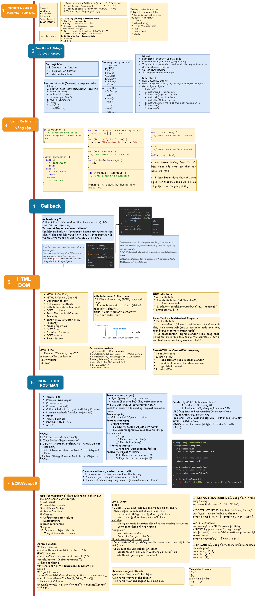

# F8-JavaScript
## Basic Javascript programming at F8
***
>[Myreport](https://docs.google.com/document/d/1aIjnrWgmq9eepTk-KKnMSa2SecNkEqfk/edit#heading=h.my4joew6nftt)

### Basic Javascript 
* Topic 1: Biến, Built-In, Toán Tử, Kiểu dữ Liêu 
* Topic 2: Làm Việc Với Hàm, Chuỗi, Mảng, Object
* Topic 3: Lệnh Rẽ Nhánh, Vòng Lặp
* Topic 4: Callback
* Topic 5: Html Dom
* Topic 6: Json, Fetch, Postman
* Topic 7: Form Validation

## Mindmap

